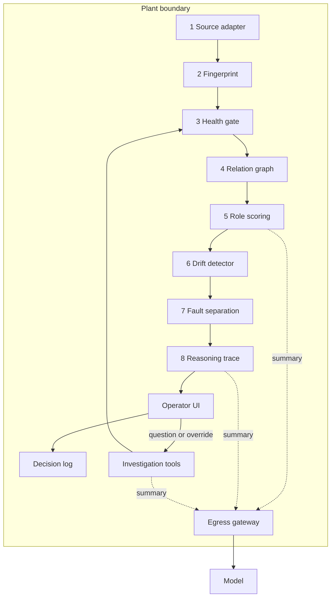
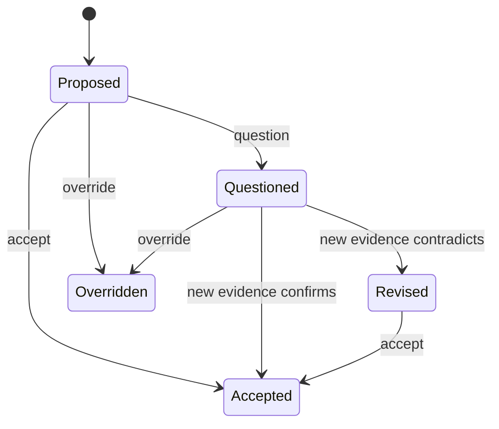

# PRD: Trustworthy Process Monitor

Norrin challenge, AaltoAI Hackathon 2026 · 2026-09-19

## 1. How we win

We win by making the model the least important part of the system. A deterministic engine finds roles, drift and faults. The model only names and explains, from summaries, and a validator rejects any sentence it cannot trace to evidence.

Most teams will send data to an LLM and ask what is wrong. That design breaks rule 4 or hallucinates. Norrin told us that hallucination and conclusions nobody can trace to a log are their two biggest problems today. We pitch the opposite design, and each scoring criterion gets one moment in the demo that proves it.

| Criterion | What judges must see | Our proof in the demo |
| --- | --- | --- |
| Rule 4 (gate) | Raw data never leaves the plant | Data-flow screen: raw MB in plant next to KB sent, every payload readable, leak scanner result 0. Turn the model off and the diagnosis still stands. |
| End-to-end autonomy | No labels, no tuned prompts | Drop the file, configure nothing. Thresholds calibrate themselves by synthetic fault injection. Prompt templates are visible and have the same hash for both datasets. |
| Data quality | Dead sensor and process fault give different results | Two incidents side by side: "Sensor fault: dead" and "Process fault: slow degradation". Different evidence, different ranked lists. The process diagnosis states that it excluded the dead sensor. |
| Human in the loop | Trace and question each output | Each claim has an evidence chip that opens the chart and the numbers. Accept, question (typed or voice), override. The decision log records all of it in a hash chain. |
| Adaptability | Same logic on messy business records | Drop a transactions file into the same build. A field that goes null is a dead sensor. A cents-for-euros change is a gain fault. No code change. |

Five decisions carry the win:

1. Evidence is a data object, not text. Each inference points to evidence IDs. No evidence, no claim.
2. Drift is measured against peers, not against limits. A sensor can stay in its normal range while it departs from what its peers predict. That is exactly the case in the problem statement.
3. The health gate runs first and masks bad sensors. A dead sensor can never become a process diagnosis.
4. One egress gateway. It is the only code that can reach a model, and it writes the data-flow record as a side effect.
5. Scope discipline. The customer knowledge corpus (calls, email, Slack, RAG) scores on none of the four criteria and adds rule 4 risk. It is one roadmap slide, not a build item. See section 11.

The pitch line for Norrin: understanding client data is the expensive part of a fixed-price project. This agent turns an undocumented stream into a first data spec in minutes, with evidence that a client engineer can check.

## 2. Problem, users and scope

A sensor can drift for weeks while its values stay in the normal range. No alarm starts. Product quality decreases, and nobody can find the cause in dashboards and logs. Business records have the same problem when many small entry errors each pass validation.

Norrin gave a concrete case. A paper machine has thousands of sensors. A drifting sensor causes false alarms on the dashboard. The crew can open the machine to inspect wear, but that is very expensive. Floor engineers know why some readings drift, but nobody writes it down, and the knowledge leaves when they leave.

### Users

| User | Situation | What they need from us |
| --- | --- | --- |
| Operator (primary) | On shift at the plant. Not a data scientist. | A diagnosis they can check, question and correct in a few clicks. |
| Norrin data engineer | Starts a new client project with undocumented data. | A sensor report that works as a first data spec. |
| Judge (this weekend) | Has a few minutes for each team. | One clear proof for each criterion and for rule 4. |

### Goals

Targets are provisional until we see the challenge package.

| ID | Goal | Target |
| --- | --- | --- |
| G1 | File drop to sensor report with zero manual input | Under 2 minutes on the challenge dataset |
| G2 | Each inference has at least one evidence object with a chart and numbers | 100% |
| G3 | Dead sensor and process fault get different fault classes | 100% of injected test cases |
| G4 | Detect slow drift before the sensor leaves its normal range | Report detection delay in days on injected drift |
| G5 | Raw values in model payloads | 0, checked by a scanner on each call |
| G6 | Second domain runs on the same build | Same code, same prompt template hash |

### Non-goals

- Live connection to a historian or OPC UA. A file replay simulates the sensor stream.
- Login, roles, multi-tenant.
- The customer knowledge corpus. It is a roadmap item (section 11).
- Model training or fine-tuning.
- Control actions. The agent never writes to the process.
- Mobile layout.

### Terms

Each term has one meaning in this document and in the UI.

| Term | Meaning |
| --- | --- |
| Sensor | One column of the sensor stream. In the second domain, one field or one derived metric. |
| Inference | One claim that the agent makes, for example a role or a fault class. |
| Evidence | A stored statistic with its method, window, numbers and chart. |
| Output | A view of inferences for the operator: sensor report, quality checks, drift output, diagnosis. |
| Summary | Aggregate statistics over at least 100 samples. The only data type that can go to a model. |
| Plant | The machine where the backend and the browser run. Raw data never crosses this boundary. |
| Model | Any LLM, local or cloud. |

## 3. Requirements traceability

Each rule and each deliverable maps to one feature and one screen. If a row has no screen, the judges cannot score it. Use this table as the acceptance checklist before the demo.

### Rules

| ID | Rule | Feature | Where judges see it |
| --- | --- | --- | --- |
| R1 | No labels | The agent replaces column headers with opaque aliases (S01, S02). It infers roles from statistics only. Prompt templates are generic and hashed. Thresholds calibrate themselves. | Run screen, Sensors screen |
| R2 | Evidence first | Each inference stores evidence IDs. Each evidence object has the correlation, the lag or the distribution, with a chart. A validator blocks claims without evidence. | Evidence sheet on each inference |
| R3 | Data before process | The health gate runs before drift and diagnosis. It masks unhealthy sensors. The decision log shows the order by sequence number. | Quality screen, Diagnosis screen |
| R4 | Nothing leaves | One egress gateway, a summary schema whitelist, a leak scanner, a data-flow record, and a model-off mode. | Data flow screen |

### Deliverables

| ID | Group | Deliverable | Feature | Screen | Criterion |
| --- | --- | --- | --- | --- | --- |
| D1 | Understand | Sensor report: role, evidence, confidence | Fingerprint, relation graph, role scoring (5.1, 5.4, 5.5) | Sensors | Autonomy |
| D2 | Understand | Quality checks: baseline checks and rules from plain language | Health gate and rule compiler (5.2, 5.3) | Quality | Data quality |
| D3 | Detect | Drift output: deviation over time, responsible sensor | Peer residual drift detector (5.6) | Drift | Data quality |
| D4 | Detect | Diagnosis: fault type, ranked sensors, reasoning steps | Fault separation and reasoning trace (5.7, 5.8) | Diagnosis | Data quality |
| D5 | Control | Accept, question, override on each output | Operator actions and investigation loop (7) | All output screens | Human in the loop |
| D6 | Control | Decision log: inference, evidence, override | Append-only log with hash chain (7) | Log | Human in the loop |
| D7 | Prove | Adaptability | A real run on business records, plus the architecture in section 4 | Runs | Adaptability |
| D8 | Prove | Data-flow record: what leaves, which model, why | Egress gateway records (6) | Data flow | Rule 4 |

All eight deliverables are P0. The deck allows an architecture walkthrough for D7, but a real second-domain run scores better, so we do the run.

## 4. Architecture

The agent is a fixed pipeline of deterministic stages inside the plant, with one guarded exit to a model. The model never decides a number or a fault class. It names, rewrites, compiles and plans.



Solid arrows carry raw data and stay inside the plant. Dotted arrows carry summaries only. The egress gateway is the single exit.

### Stages

| # | Stage | Result | Model use |
| --- | --- | --- | --- |
| 1 | Source adapter | Aliased sensors on a regular time grid. Detects stream or records layout by itself. | None |
| 2 | Fingerprint | Statistics for each sensor: type, distribution, dynamics, noise. | None |
| 3 | Health gate | Health state for each sensor and window. A mask for all later stages. | `compile_rule`: turns an operator sentence into rule JSON. Gets the sentence and the sensor catalog. |
| 4 | Relation graph | Pair correlations, lags, redundancy groups, flow order. Uses healthy windows only. | None |
| 5 | Role scoring | Role and confidence for each sensor. | `name_role`: proposes a physical name as a hypothesis from the fingerprint summary. |
| 6 | Drift detector | Deviation over time, onset, rate, responsible sensor. | None |
| 7 | Fault separation | Fault class and ranked sensors. | None |
| 8 | Reasoning trace | Ordered tests, each with a result and evidence IDs. | `explain_diagnosis`: rewrites the trace as prose. A validator checks the prose. |
| 9 | Operator loop | Actions, new tests, re-runs. | `plan_investigation`: picks tools from a fixed catalog for an operator question. |

### Principles

- The analysis code is pure functions with no network access and no file access. It cannot leak.
- The model has five purposes and five fixed templates. No template contains dataset text.
- The same file gives the same inferences. Random seeds are fixed.
- Model-off mode replaces each model call with a text template. All outputs still work.
- The backend and the browser both run in the plant. The browser draws charts from raw data, so the web app makes zero third-party requests. Fonts are self-hosted. No analytics, no error tracker.

## 5. Methods

All detection is classical statistics in TypeScript, in pipeline order below. Each method writes evidence objects. No threshold is set by hand (5.9).

### 5.1 Fingerprint

The fingerprint describes one sensor without any name. It holds the sample count, missing rate, quantiles (p1 to p99), robust spread (MAD), a histogram of at most 20 bins, step size, noise level, autocorrelation time, dominant period, share of flat runs and monotonic share.

The signal type follows from the fingerprint: constant, binary, state, counter, step-like, slow continuous or fast continuous.

### 5.2 Health gate

The health gate is the first analysis that runs, and it decides which data the later stages can use. Each check compares a window with the baseline of the same sensor. A failed check writes evidence, sets a fault class and masks the window.

| Check | Method | Fault class |
| --- | --- | --- |
| Dropout | Missing rate and gap length against baseline | Sensor fault: dropout |
| Dead | Run length of identical values far above baseline run lengths | Sensor fault: dead |
| Stuck | Noise level below 10% of baseline noise | Sensor fault: stuck |
| Spikes | Hampel filter, median and MAD | Sensor fault: spikes |
| Saturated | Probability mass at the extreme values | Sensor fault: saturated |
| Noisy | Noise level ratio against baseline | Sensor fault: noisy |
| Timebase | Duplicate, reversed or irregular timestamps | Data fault: timebase |
| Resolution | Change of step size | Data fault: resolution change |

The agent picks the baseline by itself. The baseline is the longest early segment with no change point and no failed check. The baseline window is also an inference, so the operator can override it.

### 5.3 Rule compiler

The operator writes a rule as a sentence. The model returns rule JSON in a fixed schema. The backend validates the JSON, restates the rule in plain words and counts past violations locally. The operator then activates the rule.

Rule types: range, flatline, rate of change, relation between two sensors, missing data, window aggregate. The agent also proposes baseline rules from the fingerprint, so the Quality screen has content before the operator writes anything.

```json
{ "type": "flatline", "sensor": "S07", "maxDuration": "10m", "source": "S07 must not stay flat for more than 10 minutes" }
```

### 5.4 Relation graph

- Spearman correlation for all sensor pairs on healthy baseline windows.
- Cross-correlation over a lag range. The best lag gives a directed edge: A leads B by that lag.
- Redundancy group: absolute correlation above 0.95 at lag zero. These sensors measure the same quantity.
- Flow order: a topological sort of the lead-lag edges.
- P1: partial correlation to remove indirect edges.

### 5.5 Role scoring

Each role has a score from fingerprint and relation evidence. Confidence is the margin between the best and the second score, on a 0 to 1 scale, reduced for missing data.

| Role | Evidence that scores it |
| --- | --- |
| Setpoint | Step-like signal with few levels. Another sensor tracks it with a lag. |
| Controlled variable | Tracks a setpoint. Low residual against that setpoint. |
| Actuator | Leads a controlled variable. Bounded range. Moves after setpoint steps. |
| Redundant measurement | Member of a redundancy group. |
| Upstream driver | Leads many sensors. No sensor leads it. |
| Downstream indicator | Many sensors lead it. It leads none. Candidate quality measure. |
| Counter or clock | Monotonic. |
| State flag | Binary or few levels. No sensor tracks it. |
| Unknown | No score above the floor. The report says so. |

The physical name (temperature, pressure, flow) is a separate hypothesis field from the model. Later stages never read it. A wrong name cannot cause a wrong diagnosis.

### 5.6 Drift detector

The detector measures each sensor against what its peers predict, not against fixed limits. A robust regression on the baseline predicts the sensor from its lag-aligned peers. The deviation is the standardized residual.

```math
r_i(t) = \frac{x_i(t) - \hat{x}_i(t \mid \mathrm{peers})}{\sigma_{i,\mathrm{baseline}}}
```

- Onset: CUSUM on the deviation.
- Rate and significance: Theil-Sen slope and Mann-Kendall test on daily medians.
- Sensor with no peers: distance between the rolling distribution and the baseline distribution, plus a trend test on the rolling median.
- Responsible sensor: leave-one-out. Remove the suspect from the peer models. If the other deviations stay flat, the suspect is responsible.

The drift output also states whether the value is still inside the p1 to p99 range. That line carries the main message: in range, no alarm, drift found.

### 5.7 Fault separation

The agent separates faults by one question: did one sensor leave its peers, or did the peers move together? Rows are tested from top to bottom. The first match wins.

| Pattern | Fault class |
| --- | --- |
| Health gate failed | Sensor fault with the class from 5.2. No process diagnosis uses this sensor. |
| All sensors change at one timestamp | Data fault: timebase or logging. |
| One member leaves its redundancy group | Sensor fault: drift, high confidence. |
| One sensor leaves its peers. The peers stay consistent with each other. | Sensor fault: drift. Bias if the deviation does not depend on level. Gain if it scales with level. |
| Controlled variable holds its setpoint, actuator trends, downstream sensors shift by the learned gain | Sensor fault: drift hidden by the control loop. |
| Controlled variable holds its setpoint, actuator trends, downstream sensors hold | Process fault: degradation, for example wear or fouling. |
| Related sensors move together. Their relations hold. Onsets follow the learned lags. | Process fault: step shift, slow degradation or oscillation. |

A PCA model on the healthy baseline backs the table with two statistics. A high residual statistic with one dominant sensor means the relations broke: sensor fault. A high score statistic with a normal residual means the process moved inside its normal relations: process fault. The ranked list is the contribution of each sensor, then onset order.

### 5.8 Reasoning trace

The trace is an ordered list of tests: health, drift, isolation, propagation, control loop, verdict. Each step has the test name, the numbers, the result and evidence IDs. The engine writes the trace. The model only rewrites it as prose.

A validator checks the prose before the operator sees it. Each sentence must cite an evidence ID. Each number must exist in the cited evidence. Each alias must exist. The fault class must match the engine. If a check fails, the UI shows the template text. This is our answer to hallucination. A deterministic check, not a second model, decides whether the text stands. Section 11 describes the optional cross review, which the same kind of check gates.

### 5.9 Self-calibration

The agent sets its own thresholds for each dataset. It injects synthetic faults into copies of baseline segments: bias drift at several rates, flatline, spikes, gain change. It picks the thresholds that keep false alarms under a target rate on the clean baseline.

The result is also evidence. The report says which drift rate the agent detects and after how many days. The same routine runs for both domains, so nobody tunes anything for the second domain.

## 6. Rule 4: nothing leaves

Rule 4 is a gate, so a leak is a build failure, not a bug. One module can reach a model. It accepts typed summaries only, scans each payload against the raw data, and stores the payload verbatim before it sends.

### What a summary is

| Allowed in a payload | Never in a payload |
| --- | --- |
| Alias (S01), signal type, role, fault class | Original column headers, file names, plant or customer names |
| Counts, missing rate, quantiles p1 to p99 | Rows or any sequence of samples |
| Histogram of at most 20 bins, as shares | Minimum and maximum. Each is one raw value, so we send p1 and p99. |
| Correlations, lags, slopes, test statistics | Absolute timestamps. We send offsets from the start of the dataset. |
| Rule JSON, reasoning trace, operator sentence | Audio. Voice is transcribed in the plant. |

### Guards, in order

1. Schema whitelist. The payload must parse against a strict schema. Unknown keys fail.
2. Aggregation floor. Each statistic declares its sample count. A count below 100 fails.
3. Size limits. An array holds at most 20 numbers. A payload holds at most 8 KB.
4. Rounding. All numbers round to 3 significant digits.
5. Leak scanner. The scanner rounds the raw series the same way. It searches the payload for a run of 3 or more consecutive samples. A hit blocks the call.
6. Record, then send. If the record write fails, the call does not happen.

Operator text also goes through the gateway. The record flags it as operator text, because a person can type a reading into a question.

### Data-flow record

Each model call writes one record. The Data flow screen lists the records and shows the totals: raw bytes in the plant, bytes sent, number of calls, scanner hits.

| Field | Content |
| --- | --- |
| What leaves | The payload, verbatim, with its size in bytes |
| Which model | Provider, model name, region, endpoint host |
| Why | One of five purposes: `name_role`, `compile_rule`, `explain_diagnosis`, `plan_investigation`, `cross_review` |
| Proof | Result of each guard, template hash, linked inference ID |
| What came back | The response, verbatim, and the validator result |

### Enforcement in code

- The model SDK is a dependency of the egress package only. A lint rule fails the build if another package imports it or calls `fetch`.
- The backend allows outbound traffic to the primary model host and, when a reviewer endpoint is set, to that host. Each record names its host, and the Data flow totals list each host.
- A canary test runs the full pipeline on a dataset of unique values. It fails if any of those values appears in a payload.
- Server logs stay on the plant machine. No raw value goes to a log service.

### Model choice

The default is a cloud model in Azure behind a provider adapter. Norrin told us that client models usually run in the client's Azure environment, so this matches a real deployment. The second option is a local model through Ollama for a plant with no outbound traffic. Model-off mode needs no model at all.

## 7. Operator control and decision log

The operator can accept, question or override each inference, and each action changes what the agent does next. A control that changes nothing is decoration, and judges will test it.

| Action | The operator | The agent |
| --- | --- | --- |
| Accept | Clicks once. | Marks the inference as accepted. Later runs use it as a fact. |
| Question | Types or speaks a question or a hunch. | Plans tests from a fixed tool catalog. Runs them in the plant. Attaches new evidence. Confirms or revises the inference in the same thread. |
| Override | Picks a different value and gives a reason. Values: role, fault class, baseline window, responsible sensor. | Stores the override. Runs the later stages again with the override as a fact. Shows what changed. |



### Investigation tools

The model picks tools for a question. The engine runs them. Each tool returns evidence.

| Tool | Use |
| --- | --- |
| `compare_windows` | Compare the distribution of one sensor in two windows. |
| `test_relation` | Test correlation and lag between two sensors in a window. |
| `find_changepoints` | Find change points for one sensor near a time. |
| `rerun_without` | Run drift and diagnosis again with one sensor masked. |
| `test_role` | Score one sensor against one role. |
| `check_rule` | Count violations of one rule in a window. |

### Voice hunch (P1)

The operator holds a button and speaks, for example: "I think someone replaced the steam valve around week three." A local Whisper model transcribes the audio in the plant. The transcript becomes the question. The agent then looks for change points on actuators near day 21 and compares the windows before and after.

Typed questions are P0. Voice is P1, because it adds demo value but no new scoring criterion.

### Decision log

The decision log is an append-only table with a hash chain. Each entry stores the hash of the previous entry plus its own content. A Verify button recomputes the chain.

- Entry types: inference created, evidence attached, model call, rule compiled, rule activated, accept, question, override, rerun.
- Fields: sequence number, time, type, actor (agent or operator), inference ID, evidence IDs, data-flow record ID, before and after values, reason, hash.
- Export: JSON and CSV.
- Trace: one click from a log entry to its inference, evidence and chart. One click from a sentence in a diagnosis to its evidence. This answers Norrin's complaint that nobody can tell which log a conclusion comes from.

Questions and override reasons stay attached to the sensor. The next run shows them in the sensor report. This is the first small step toward the knowledge that today leaves with the engineers.

### Data objects

```ts
type Evidence = {
  id: string
  kind: "correlation" | "lag" | "distribution" | "trend" | "changepoint" | "residual" | "health" | "rule"
  sensors: string[]
  window: { from: number; to: number; n: number }
  method: string                 // "spearman", "xcorr", "cusum", "theil-sen"
  stats: Record<string, number>
  verdict: string
  chart: ChartSpec               // drawn in the plant from raw data
}

type Inference = {
  id: string
  stage: "baseline" | "health" | "role" | "drift" | "diagnosis" | "rule"
  claim: string
  value: unknown
  confidence: number             // 0 to 1
  evidenceIds: string[]          // never empty
  status: "proposed" | "accepted" | "questioned" | "revised" | "overridden"
  supersedes?: string
}
```

## 8. UI spec

The UI is black, white and gray, with no hue anywhere. Status uses shape, fill, line style and words. This also keeps the UI readable for color-blind operators.

### Tokens

Use the shadcn neutral base, force dark mode on the root element, and override the theme variables.

| Token | Value |
| --- | --- |
| background | #000000 |
| card, popover | #0A0A0A |
| muted, secondary, accent | #141414 |
| border, input | #262626 |
| ring | #525252 |
| muted-foreground | #A3A3A3 |
| foreground, primary | #FAFAFA |
| primary-foreground | #000000 |
| destructive | #FAFAFA. No red. A destructive action is a solid white button with an icon and a confirm dialog. |
| chart-1 to chart-5 | #FAFAFA, #A3A3A3, #737373, #525252, #404040 |

Radius is 0.375rem. Text uses Geist Sans. Numbers, aliases, IDs and hashes use Geist Mono with tabular figures. Both fonts are self-hosted. Base text is 14 px, and tables are dense with right-aligned numbers.

### Status without color

| Meaning | Encoding |
| --- | --- |
| Healthy | Outline badge, hollow circle icon, gray text |
| Drift | Dashed-border badge, trend icon |
| Sensor fault | Solid white badge, circle-off icon |
| Process fault | Solid white badge, triangle icon |
| Data fault | Solid white badge, file-warning icon |
| Model hypothesis | Italic text, sparkle icon, the word "hypothesis" |
| Accepted, questioned, overridden | Check icon, question icon, pen icon, each with the word |
| Confidence | Bar of 5 segments plus the number in mono |

### Charts

All charts use the shadcn Chart component.

- Responsible sensor: solid white line, 2 px. Expected value from peers: dashed gray line. Peers: gray lines, 1 px.
- Baseline band from p1 to p99: white fill at 6% opacity.
- Onset: vertical dashed line with a label.
- Masked window from the health gate: diagonal hatch pattern.
- The deviation chart sits under the value chart and shares its time axis. The threshold is a dotted line.

### Screens

| Screen | Content | Main shadcn components |
| --- | --- | --- |
| Run | File drop. Pipeline steps with counts and timings. No settings. | Card, Button, Progress, Skeleton, Sonner |
| Sensors (D1) | Table: alias, signal type, role, hypothesis name, confidence, health, status. A row opens the fingerprint, role candidates and top relations with lags. | Data Table, Badge, Sheet, Tabs, Chart, Tooltip |
| Quality (D2) | Baseline checks for each sensor. Rule list. Sentence input with compiled rule preview and past violation count. | Tabs, Table, Textarea, Dialog, Switch, Alert |
| Drift (D3) | Small multiples sorted by severity. Detail view: value against expected, deviation, onset, rate, in-range flag. | Card, Chart, Toggle Group, Scroll Area |
| Diagnosis (D4) | Incident cards: fault class, ranked sensors with contribution bars, numbered reasoning steps with evidence chips. | Card, Badge, Accordion, Progress, Hover Card |
| Log (D6) | Decision log with filters, hash column, Verify, Export. | Data Table, Dropdown Menu, Input, Button |
| Data flow (D8) | Totals, record table, payload viewer, model-off switch, boundary diagram. | Card, Table, Dialog, Switch, Separator |
| Runs (D7) | Runs for each domain. Side-by-side compare. | Table, Tabs |

### Shared parts

- Navigation: Sidebar, Breadcrumb, and Command for a jump to any sensor or inference.
- Evidence sheet: one Sheet component. Each evidence chip in the app opens it. It shows the chart, the method, the window and the numbers.
- Action bar: Accept, Question, Override. The same component sits on each inference.
- Lens: the agent detects the domain and changes words only. Stream lens: sensor, plant, operator. Records lens: field, source, analyst.

### Component rule

Use shadcn components only. A custom component is a composition of shadcn primitives, for example an evidence chip is a Badge plus a Hover Card. Icons come from lucide, which ships with shadcn. No other UI library and no other chart library.

## 9. Stack and repo layout

One TypeScript monorepo holds everything: React, Tailwind and shadcn in the browser, Node in the backend, and shared schemas between them. One language means one person can move between the engine and the UI during the weekend.

| Layer | Choice | Reason |
| --- | --- | --- |
| Frontend | React, TypeScript, Vite, Tailwind CSS, shadcn/ui | Your constraint. Vite starts fast. |
| Frontend data | TanStack Query, TanStack Table, React Router | The shadcn Data Table builds on TanStack Table. |
| Charts | shadcn Chart (Recharts) | The only chart library that the component rule allows. |
| Backend | Node, TypeScript, Hono | Small and typed. Server-Sent Events report pipeline progress. |
| Compute | Worker threads, `Float64Array` | The API stays responsive while the analysis runs. |
| Schemas | zod in a shared package | One schema validates the API, the database rows and the egress whitelist. |
| Storage | SQLite through better-sqlite3 | One file. Tables: runs, sensors, evidence, inferences, rules, decision log, data-flow records. Raw data stays as files. |
| Statistics | simple-statistics, ml-matrix, ml-pca, plus own code | We write CUSUM, Theil-Sen, Mann-Kendall, Hampel and cross-correlation. Each is about 50 lines. |
| Parsing | csv-parse in streaming mode | Large files do not fill memory. |
| Model | Provider adapter in the egress package: Azure OpenAI or Ollama | Structured output, checked with zod. |
| Voice (P1) | Whisper in the browser through transformers.js | Audio never leaves the plant. |
| Tests | Vitest | Synthetic signals for the core package. Canary test for rule 4. |
| Tooling | pnpm workspaces, ESLint `no-restricted-imports` | The lint rule enforces the egress boundary. |

### Repo layout

```text
apps/
  web/            React, Tailwind, shadcn. Screens from section 8.
  server/         Hono API, SSE, workers, SQLite.
packages/
  core/           Pure analysis functions. No I/O. No network.
  adapters/       Stream adapter, records adapter, layout detection.
  egress/         Gateway, guards, leak scanner, provider adapters, templates.
  schemas/        zod schemas shared by web and server.
scripts/
  inject-faults.ts   Synthetic faults for calibration and tests.
  canary.ts          Rule 4 canary run.
data/             Git-ignored. The challenge package goes here.
```

### API

| Method and path | Purpose |
| --- | --- |
| `POST /runs` | Upload a file and start the pipeline. |
| `GET /runs/:id/events` | Pipeline progress as Server-Sent Events. |
| `GET /runs/:id/sensors`, `/quality`, `/drift`, `/incidents` | The four outputs. |
| `GET /evidence/:id`, `GET /evidence/:id/series` | Evidence numbers, and the raw series for its chart. Plant only. |
| `POST /inferences/:id/accept`, `/question`, `/override` | Operator actions. |
| `POST /rules/compile`, `POST /rules/:id/activate` | Rule compiler. |
| `GET /log`, `/log/verify`, `/log/export` | Decision log. |
| `GET /egress`, `GET /egress/:id`, `PUT /settings/model` | Data-flow records. Model mode: off, local or cloud. |

Pair correlation grows with the square of the sensor count. For a plant with thousands of sensors, downsample first, filter pairs by signal type, and keep the top peers for each sensor.

## 10. Second domain: business records

Business records run through the same stages 2 to 9. Only the source adapter differs, and the agent picks the adapter by itself. The Runs screen shows the same commit hash and the same template hashes for both runs.

### Layout detection

- Stream: one row for each time step, mostly numeric columns, regular timestamps.
- Records: one row for each event, irregular timestamps, ID columns and category columns.

### Records adapter

The adapter profiles each field as timestamp, ID, number, category or free text. It then derives metrics for each time bucket. Each metric becomes one sensor. The adapter sizes the bucket so that each bucket holds at least 100 rows, which also satisfies the aggregation floor of rule 4.

- Row count.
- Null rate of each field.
- Median and p95 of each number field.
- Share of the top categories of each category field.
- Distinct count and duplicate rate of each ID field.
- Format violation rate. The agent learns the majority pattern of a field and counts the rows that differ.
- Last-digit and rounding share of amounts. A change shows a new entry habit.

### How the concepts map

| Plant | Business records | Example |
| --- | --- | --- |
| Sensor | One derived metric of one field | Null rate of the postcode field |
| Dead sensor | A field that goes null or constant after a date | A software release stops a field. Sensor fault: dead. The business did not change. |
| Bias drift | A slow rise of a rate or a median | Format violations rise by a small amount each week. |
| Gain fault | A unit change | One source sends cents, not euros. The deviation scales with level. |
| Redundancy group | Fields that must agree | Net plus tax equals gross. City agrees with postcode. |
| Process fault | A real business change | Row count, basket value and conversion move together with the learned lags. |
| Responsible sensor | Responsible source | The agent splits a metric by a category field. One terminal or one user leaves its peers. |

This is how the agent finds entry errors that pass validation one at a time. Each row is valid. The rate is not.

### Test data

Use business records from the challenge package if it has them. If not, use a public transactions or web shop dataset and inject four faults with `inject-faults.ts`: a field that goes null from a date, a cents-for-euros change in one source, a slow rise of typos, and a real decrease in demand. Report the same detection numbers as for the sensor stream.

## 11. Bonus layer from the Norrin conversation

The customer knowledge corpus is the best business idea in your notes, and we do not build it this weekend. It scores on no criterion. Its raw material is customer calls, email and Slack, so a RAG pipeline puts rule 4 at risk. If sensor names from client documents reach the agent, it also breaks rule 1.

We use the conversation in a different way. Each pain that Norrin named gets an answer inside the judged scope.

| What Norrin said | What we do | Where |
| --- | --- | --- |
| AI hallucinates on these problems. | The engine decides. The model rewrites. The validator checks. Model-off mode still works. | 5.8, 6 |
| Nobody can tell which logs a conclusion comes from. | Each sentence cites evidence IDs. One click opens the chart and the numbers. | 7 |
| They tried cross-AI review. | A deterministic validator checks every model text. A cross review by open models is an optional second opinion on one incident. The reviewers get the guarded summary without the engine verdict. The same validator checks their text. Their answer stays a hypothesis. | 5.8, 6 |
| A drifting sensor causes false alarms. Opening the machine is very expensive. | Sensor fault against process fault, with a ranked list. The crew recalibrates one sensor and keeps the machine closed. This is the demo story. | 5.7 |
| Understanding client data is the big cost. Clients want a fixed price. | The sensor report exports as a first data spec in Markdown and JSON (P1). | 8 |
| Knowledge leaves with the engineers. Calls are not recorded. | Questions, hunches and override reasons stay on the sensor for the next run. | 7 |
| Client models usually run in the client's Azure environment. | The default provider adapter is Azure OpenAI. | 6 |
| Nobody knows how secure vibe-coded software is. | Rule 4 is a test, not a promise: lint boundary, canary test, a named outbound host per call. | 6 |
| There are too many debug logs to inspect by hand. | P2: the records adapter reads a log file. Error rate and message pattern shares become sensors. | 10 |

### Roadmap slide: context layer

Show this as the last slide, as the path from hackathon to product.

1. Blind run first. The agent infers roles with no labels, as it does today.
2. Reconcile second. A corpus of calls, email, Slack and client documents proposes names and known events for each sensor. The UI shows them as a separate evidence kind with a source link.
3. Spec builder. Sensor report, reconciled names and rules become the data spec for the ML model and the dashboard.
4. The corpus stays in the client tenant and uses the same egress gateway.

The order matters. A blind run finds the places where the client documentation is wrong.

## 12. Build plan, demo script, risks

Build the full product in model-off mode first, then add the model. This order keeps rule 4 safe by default, and a failed model call cannot stop the demo. The plan assumes about 24 build hours and two tracks. Scale the blocks to the real event length.

| Hours | Engine track | UI track | Done when |
| --- | --- | --- | --- |
| 0 to 2 | Repo, schemas, upload, stream adapter, aliases | App shell, theme tokens, Sidebar, Run screen | A file loads and a sensor list shows. |
| 2 to 7 | Fingerprint, health gate, baseline, relation graph, role scoring | Sensors screen, evidence sheet, charts | D1 works with evidence. |
| 7 to 12 | Peer model, drift detector, fault separation, reasoning trace, fault injector | Quality, Drift and Diagnosis screens | D3 and D4 work with the model off. Dead sensor and process fault differ. |
| 12 to 16 | Egress gateway, guards, leak scanner, four templates, validator, rule compiler | Data flow screen, rule input, action bar | D2 and D8 work. The canary test passes. |
| 16 to 19 | Operator actions, investigation tools, reruns, hash chain | Log screen, question thread, override dialog | D5 and D6 work. |
| 19 to 22 | Records adapter, second dataset, self-calibration report | Runs screen, lens | D7 works on the same build. |
| 22 to 24 | Freeze. Three rehearsals. Backup video. Slides. | | The demo runs in 5 minutes. |

Cut order if time runs short: voice hunch, spec export, log file adapter, partial correlation, PCA backing. Never cut the Data flow screen, the dead sensor against process fault demo, override with rerun, or the second-domain run.

### Demo script, 5 minutes

1. 0:00. Tell the story in one sentence: a paper machine, drift inside the normal range, no alarm, and a very expensive decision to open the machine.
2. 0:20. Drop the challenge file. Change no setting. Show the aliases. Say: "The agent never saw a column name."
3. 0:50. Open one sensor in the sensor report. Show the role, the confidence and the lag chart behind it.
4. 1:30. Open the drift output. The value chart stays in range. The deviation chart shows the onset days before any limit.
5. 2:00. Show two incidents side by side: a dead sensor and a process fault. Click a sentence. The evidence opens.
6. 2:45. Question one inference. The agent runs a new test. Override a role. The diagnosis runs again. Open the decision log and verify the chain.
7. 3:30. Open the Data flow screen. Compare raw MB with KB sent. Open a payload. Show scanner hits: 0. Switch the model off. The diagnosis stands. Show the outbound hosts in the Data flow totals.
8. 4:10. Drop the transactions file into the same build. Show the dead field and the cents-for-euros gain fault.
9. 4:40. Close with the value for Norrin and the roadmap slide.

Record a backup video of this script before the judging starts.

### Risks

| Risk | Response |
| --- | --- |
| The dataset has few sensors, so the peer model is weak. | The distribution drift path in 5.6 needs no peers. |
| The package has no fault labels, so we cannot show accuracy. | The fault injector gives detection numbers. Say clearly that they come from injected faults. |
| Timestamps are missing or irregular. | The adapter resamples to a regular grid. With no timestamps, it uses the row index as time. |
| The model proposes a wrong physical name. | The name is a hypothesis with a confidence. Later stages do not use it. |
| A side channel leaks data: logs, fonts, analytics, an error tracker. | Zero third-party requests. Canary test. Show the network tab. |
| TypeScript math is slow on a large file. | Downsample for relations. Use worker threads. Keep a computed run in SQLite for the demo. |
| The team drifts into the corpus idea. | Section 11 is one slide. |
| The live demo fails. | Backup video, plus the computed run. |

### Open questions

- [ ] What are the format, size and sampling rate of the dataset? Does it have timestamps?
- [ ] Do the column headers carry meaning? We alias them in any case.
- [ ] Does the challenge package include business records, or do we bring our own?
- [ ] Does the package label any faults?
- [ ] Which model providers and keys can we use? Do the judges accept a local model as "a model"?
- [ ] How long is the demo, and is it live, video or slides?
- [ ] How long is the hackathon, and who owns the engine, the UI and the pitch?
